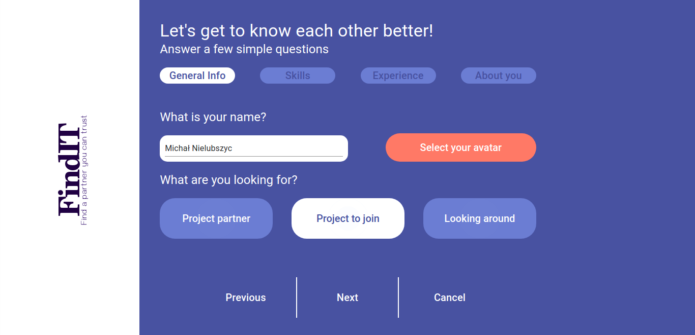
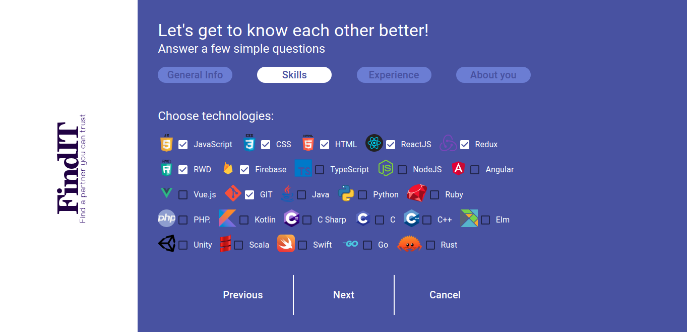
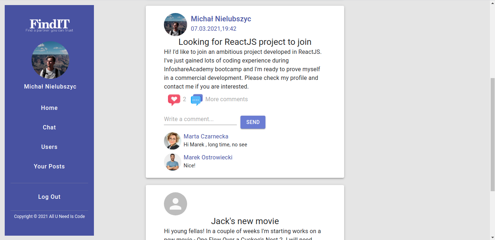
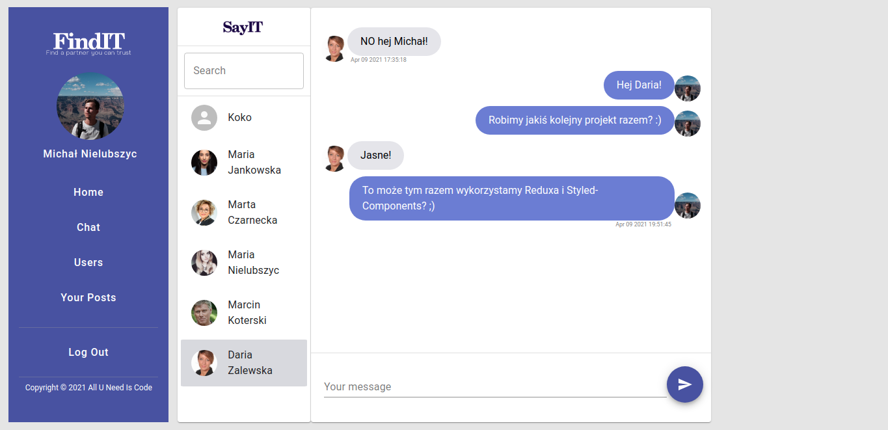
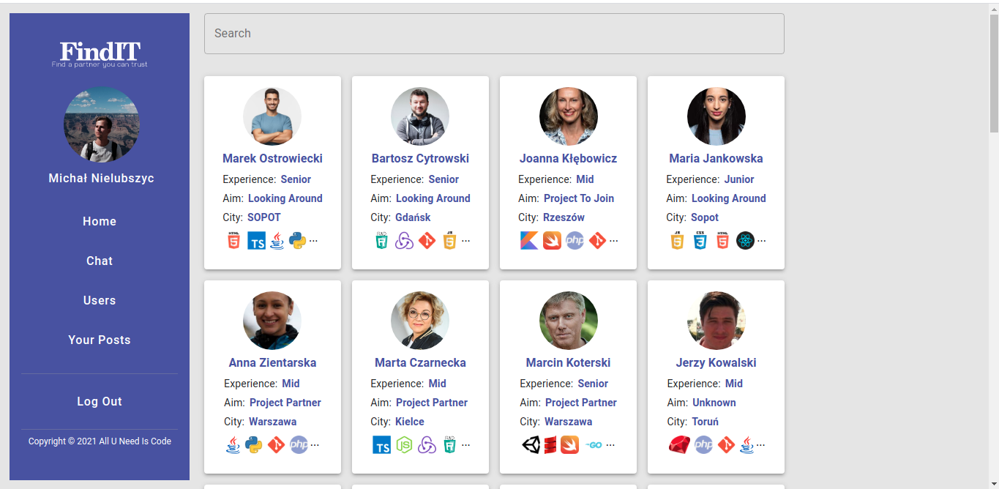
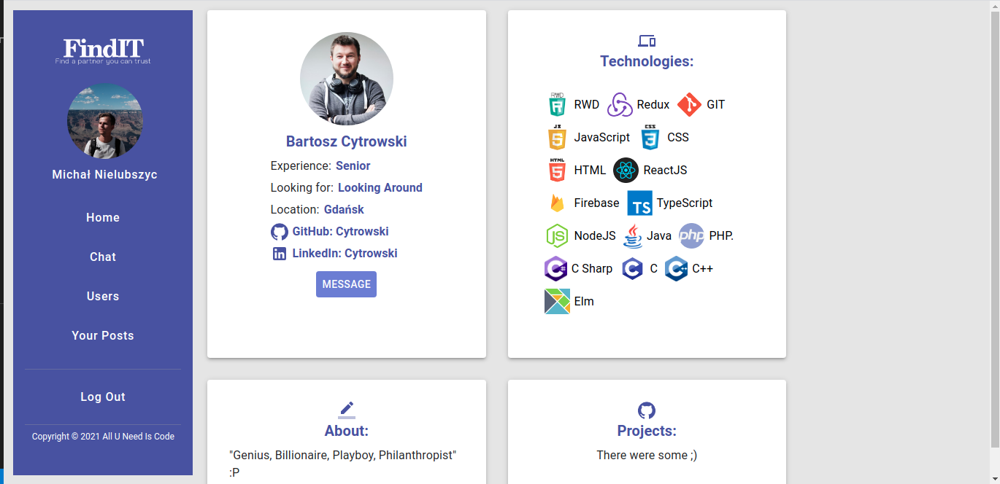

[FindIT Application](https://infoshareacademy.github.io/jfdzr2-all-you-need-is-code/#/) 

### About

FindIt is a social media web application developed in ReactJS using Firebase that is meant to help IT community members find partners for their projects, search for projects to join, as well as share their work and chat with other developers.

This is a project developed during a 6-months long "Junior Frontend Developer" bootcamp organized by InfoShare Academy. The main goal was to create a complex ReactJS web application using knowledge gained during the course. 

It was created by a team: 
- [Daria Zalewska](https://github.com/daria-zalewska) 
- [Michał Nielubszyc](https://github.com/MichalNielubszyc) 
- [Kamil Plewka](https://github.com/Kamil12a)

### Features

What you can do using FindIT app:

1. Sign up and create your profile
    - create your account using Firebase Authentication
    - fill our wizard form survey with information like: your name, what's your aim (to join a project etc.), experience, technologies, location, github & linkedIn profiles, your IT projects and section about you.
    - pick your avatar
    - then you can edit your data on your profile page 

2. Create posts
    - you can create posts that will be visable to all users
    - you can comment and react with likes on post created by other users

3. Chat with other users
    - you can search for user you'd like to text on the chat page
    - you can also go to chat with a selected user by clicking message button on profile page

4. Look for other users and check their profile pages
    - scroll the users page to find users you'd like to get in touch with
    - go to their profile pages to learn more about them

### Environment, backend & deployment

FindIT web application was written in ReactJS. We developed it using React Hooks: useState for app state management, useEffect for fetching data, manual changes of DOM and other, useContext for passing data between components.

Backend features were implemented using Firebase. We used Firestore Database to store data: users and their data, posts with comments and likes, as well as chat messages. Authentication allowed us to create sing up & log in system. Storage helped us keep our users' avatars.

FindIT has been deployed via Github Pages, create your profile, post and communicate with others: <a href="https://infoshareacademy.github.io/jfdzr2-all-you-need-is-code/#/" target="_blank">Link to page</a>

### Feedback

If you have any comments on this project feel free to leave them in issues or contact us via GitHub.

### Thanks

We wanted to thank our trainers <a href="https://github.com/cytrowski">@cytrowski</a> and <a href="https://github.com/nikodem-kalinowski">@nikodem-kalinowski</a> from <a href="https://github.com/infoshareacademy">infoShare Academy</a> for all the help and support they gave us during this project.